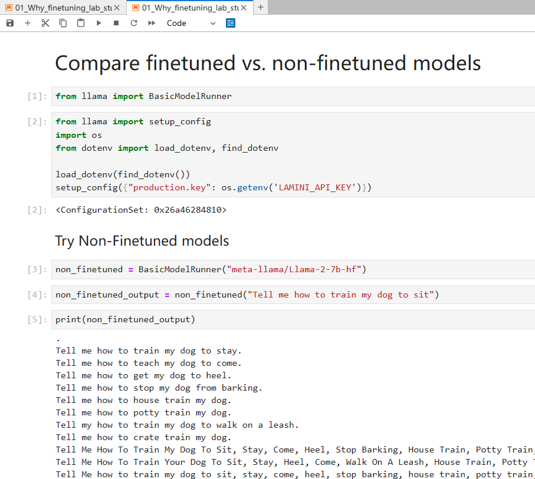

# Finetuning Large Language Models

This repository contains code and examples from the [Finetuning Large Language Models ↗](https://www.deeplearning.ai/short-courses/finetuning-large-language-models/) course by DeepLearning.AI.

## Course Overview

Chapters:

0. Introduction
1. Why finetune
2. Where finetuning fits in
3. Instruction finetuning
4. Data preparation
5. Training process
6. Evaluation and iteration
7. Consideration on getting started now
8. Conclusion

In this course you will learn:

- When to apply finetuning on large language models (LLMs)
- How to prepare data for finetuning
- How to train and evaluate an LLM on your data

With finetuning, you can update the weights of an LLM neural network on new data, customizing the model for your specific needs.

## Repository Contents

- `data/` - Example datasets used in the course
- `notebooks/` - Jupyter notebooks walking through the techniques
- `scripts/` - Utility scripts for preprocessing data etc
- `results/` - Outputs from model training runs

## Running Examples

To run the demo notebooks:

1. Clone the repository
2. Install dependencies with `pip install -r requirements.txt`
3. Create a `.env` file in the root directory of the project and add your Lamini API key like so:

    ```
    # .env
    LAMINI_API_KEY=your_api_key_here
    ```

4. Start Jupyter notebook and open the notebooks. In the notebook, use the following code to setup the API key:

    ```python
    from llama import setup_config
    import os
    from dotenv import load_dotenv, find_dotenv

    load_dotenv(find_dotenv())
    setup_config({"production.key": os.getenv('LAMINI_API_KEY')})
    ```

### Note

I found the official documentation for using the API key a bit difficult to understand. The instructions provided here are based on my best understanding and experimentation. If you have any suggestions or improvements, please feel free to contribute!



## Course Resources

Get access to the course materials at [DeepLearning.AI ↗](https://www.deeplearning.ai/short-courses/finetuning-large-language-models/).

Let me know if you need any clarification or have additional suggestions!
